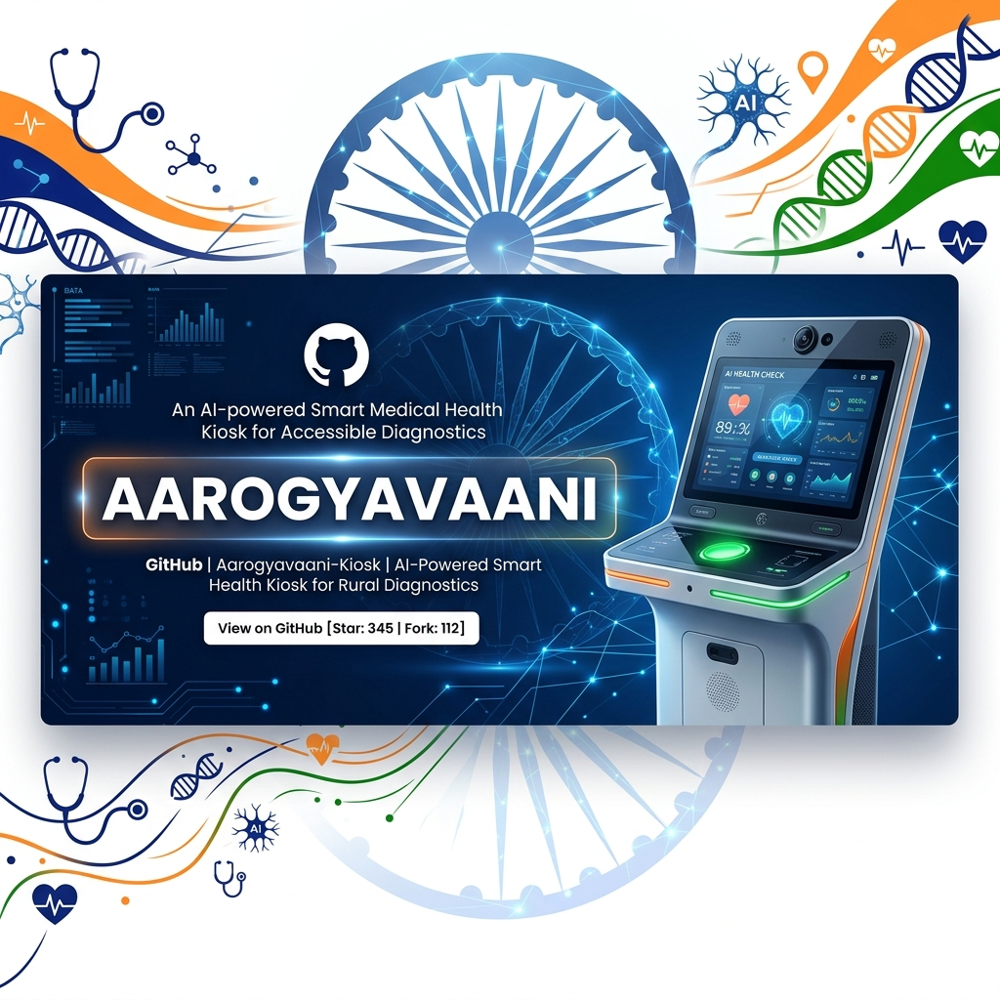
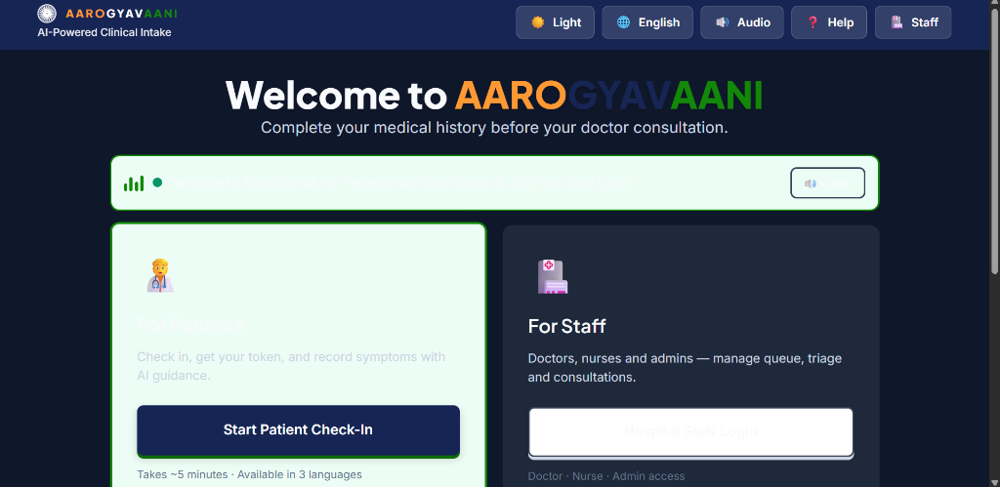

<div align="center">
  

  <h1>AAROGYAVAANI</h1>
  <p><strong>AI-Powered Clinical Intake & Hospital Platform</strong></p>
  
  <p>
    Built for <strong>Smart India Hackathon (SIH)</strong><br/>
    <em>Empowering hospitals with AI-driven triage, multilingual voice assistants, and secure queue management.</em>
  </p>
</div>

---

## 🚀 Smart India Hackathon (SIH) Problem Statement

**AAROGYAVAANI** was designed and developed as a comprehensive solution for the Smart India Hackathon. 

**The Challenge:** Outpatient Departments (OPDs) in Indian hospitals face massive overcrowding, leading to long wait times, overworked staff, and delayed critical care. Language barriers and low health literacy further complicate the intake process for rural patients.

**Our Solution (AAROGYAVAANI):** 
A smart, multilingual, AI-powered health kiosk that automates patient check-in, captures clinical history, and performs intelligent triage before the patient even sees the doctor. 
- 🌐 **Multilingual Voice Assistant:** Supports English, Hindi, and Punjabi with continuous voice interactions.
- 🏥 **Seamless Hospital Flow:** Includes dedicated portals for Patients (Kiosk), Nurses (Triage), Doctors (Consultation), and Admins (Analytics).
- 🚨 **AI Red-Flag Detection:** Instantly alerts staff to critical symptoms (e.g., chest pain).

---

## 📸 Screenshots

### Kiosk Interface (Dark Mode)


---

## 🛠 Tech Stack

- **Frontend:** React + Vite (Pure CSS, 3D modern UI with Tricolor theme)
- **Backend:** Node.js + Express
- **Database:** MongoDB (Mongoose) with an intelligent in-memory fallback mechanism if DB goes offline.
- **AI Integration:** Google Gemini API (Strictly structured JSON extraction for medical history).

## 📁 Project Structure

```text
Aarogyavaani/
  banner.jpg           # Project Banner
  screenshot_dark.png  # UI Screenshot
  frontend/            # React + Vite app
    src/css/           # Custom CSS (variables, 3D UI, Kiosk, Staff)
    src/pages/         # 70+ UI Screens (Check-in, History, Doctor, Triage, Admin)
  backend/             # Express API (server.js, routes, memory fallback)
```

## ⚙️ How to Run Locally

### 1. Start the Backend
```bash
cd backend
npm install
npm run dev
# Runs on http://localhost:5000
```

### 2. Start the Frontend
```bash
cd frontend
npm install
npm run dev
# Runs on http://localhost:5173
```
*Note: The frontend is configured to proxy API requests to the backend automatically.*

## 🏥 Demo Logins (Staff Portal)
Navigate to `/staff/login` or click the **Staff** button on the kiosk.

| Staff Role | Staff ID | Password | 
|---|---|---|
| **Doctor** | DOC-104 | doctor123 |
| **Triage / Nurse** | NUR-88421 | nurse123 |
| **Admin** | ADM-01 | admin123 |

## 🌟 Key Features

- **Tricolor Theme & 3D UI:** A beautiful, responsive interface inspired by the Indian National Flag, complete with an animated Ashoka Chakra.
- **Light/Dark Mode:** Seamlessly toggle between day and night modes for comfort.
- **Multilingual Support:** One-click dropdown to switch the entire UI and AI Voice to Hindi or Punjabi.
- **Hardware Integration Ready:** Designed to work on large touch-screen kiosks (64px touch targets).

---
<div align="center">
  <i>Proudly built for SIH.</i>
</div>
